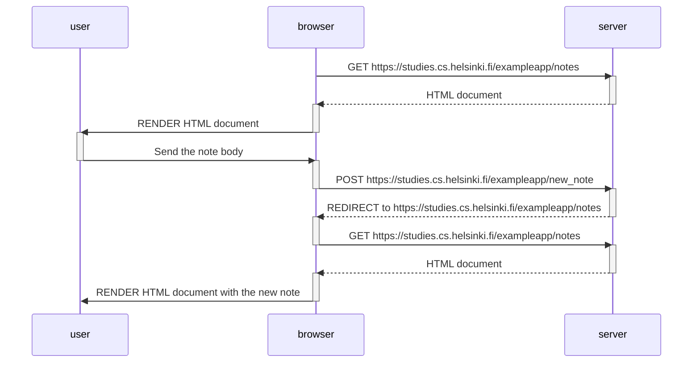

# Diagram of create new note

```mermaid
sequenceDiagram
    participant user
    participant browser
    participant server

    browser->>server: GET https://studies.cs.helsinki.fi/exampleapp/notes
    activate server
    server-->>browser: HTML document
    deactivate server

    activate browser
    browser->>user: RENDER HTML document
    deactivate browser

    activate user
    user->>browser: Send the note body
    deactivate user

    activate browser
    browser->>server: POST https://studies.cs.helsinki.fi/exampleapp/new_note
    deactivate browser

    activate server
    server-->>browser: REDIRECT to https://studies.cs.helsinki.fi/exampleapp/notes
    deactivate server

    activate browser
    browser->>server: GET https://studies.cs.helsinki.fi/exampleapp/notes
    deactivate browser

    activate server
    server-->>browser: HTML document
    deactivate server

    activate browser
    browser->>user: RENDER HTML document with the new note
    deactivate browser

```
