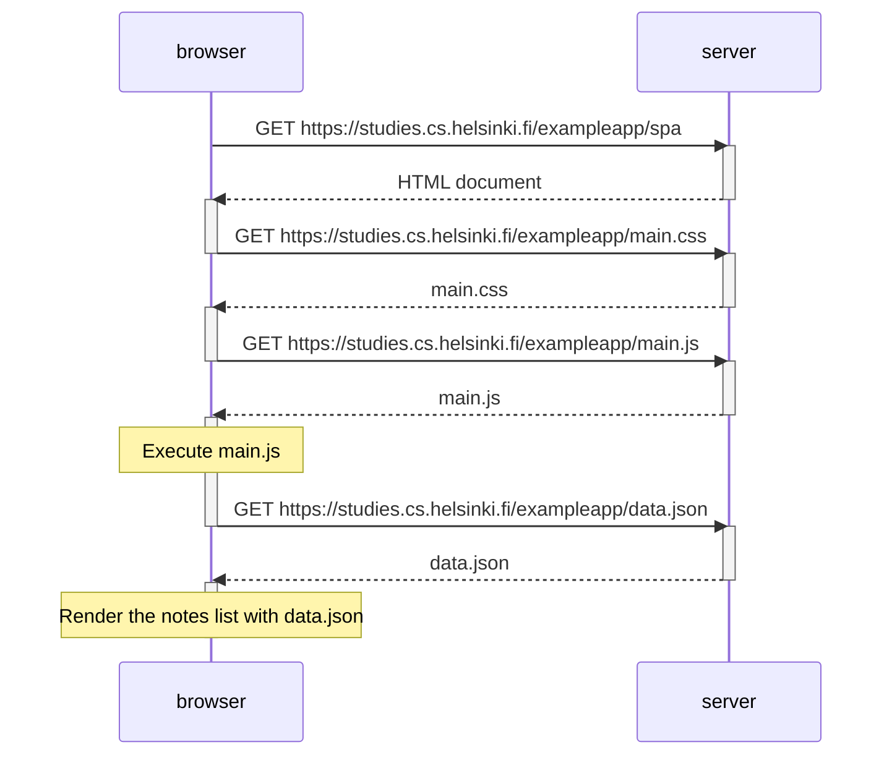

# Single page app diagram

```mermaid
sequenceDiagram
    participant browser
    participant server

    browser->>server: GET https://studies.cs.helsinki.fi/exampleapp/spa

    activate server
    server-->>browser: HTML document
    deactivate server

    activate browser
    browser->>server: GET https://studies.cs.helsinki.fi/exampleapp/main.css
    deactivate browser

    activate server
    server-->>browser: main.css
    deactivate server

    activate browser
    browser->>server: GET https://studies.cs.helsinki.fi/exampleapp/main.js
    deactivate browser

    activate server
    server-->>browser: main.js
    deactivate server

    activate browser

    Note over browser: Execute main.js

    browser->>server: GET https://studies.cs.helsinki.fi/exampleapp/data.json
    deactivate browser

    activate server
    server-->>browser: data.json
    deactivate server

    activate browser
    Note over browser: Render the notes list with data.json
    deactivate browser
```
